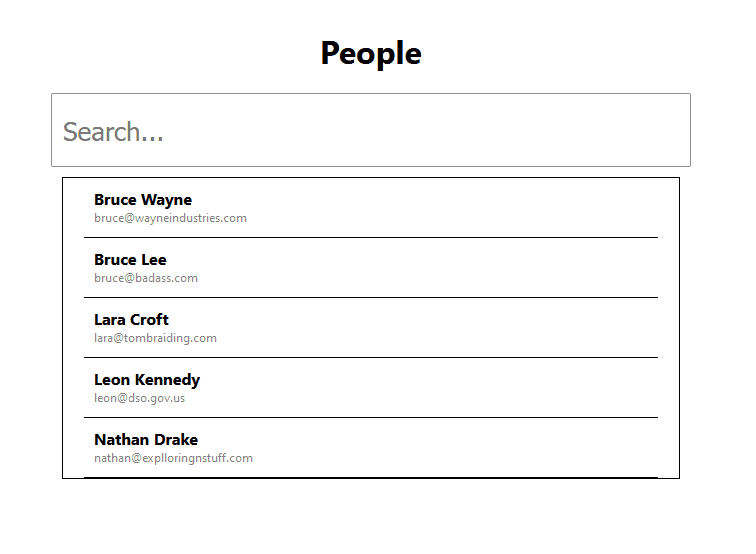

# useSearchableList

**This project is partially maintained** feel free to request update/post issue on the github though!

A hook written for a personal project that I decided could be useful to I separated it out to its own package to deploy to npm for others to use, plus with it beeing open source anyone can contribute to improve it for the better of us all.

 

## Options

| Name                | Type    | Description                                               |
| ------------------- | ------- | --------------------------------------------------------- |
| clearOnEmpty        | boolean | Should the list be empty if there is no filter value      |
| firstCharacterCheck | boolean | Should the first character entered run a startsWith check |
| debounce            | boolean | Should the filter list use debounce                       |
| delay               | number  | The delay of the debounce                                 |

## Example Usage

Define the hook baseed on the filter property name & optionally set props

```typescript
const [people, setPeople, filter] = useSearchableList<Person>('firstname', {
    debounce: true,
    delay: 300
});
```

Call the filter function and pass in a value to filter by

```typescript
  const handleChange = (event: React.FormEvent<HTMLInputElement>) => {
    const value: string = event.currentTarget.value;
    filter(value);
  };

  return (
    <div className="App">
      <h1>People</h1>
      <input
        className="SearchBar"
        onChange={handleChange}
        type="text"
        name="example"
        placeholder="Search..."/>
        ....
```

Use the returned list to display whatever you want to do

```typescript
<div className='PersonList'>
    {people.map((person: Person) => {
        return (
            <PersonProfile
                firstname={person.firstname}
                lastname={person.lastname}
                email={person.email}
            />
        );
    })}
</div>
```


